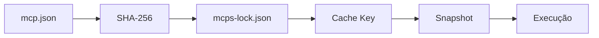

# 🏗️ MCPs as Objects

> **Gestão determinística de MCPs como objetos — replicável, contínuo, event-driven.**

```
┌──────────────────────────────────────────────────────────────────┐
│  GESTÃO MCPS AS A OBJECT                                        │
│  └─ Toda estrutura gerenciada por padrão único e rígido          │
│  └─ Determinístico: mesmo input + mesmo manifesto = mesmo output│
│  └─ Runtime em GitHub Workflow com cache inteligente (SHA-256)   │
│  └─ Backend + SQLite + API + CLI                                 │
│  └─ Catálogo com descrição, funções, input/output schema         │
│  └─ Constructor: cria MCPs replicáveis a partir de template     │
│  └─ Event-driven: cada MCP responde ao seu próprio evento        │
│  └─ Cache isolation: SHA-256 do lockfile → cache key única      │
└──────────────────────────────────────────────────────────────────┘
```

---

## ✨ Replicável Contínuo — Como Funciona

### O Ciclo

```
┌──────────┐    ┌──────────┐    ┌──────────┐    ┌──────────┐
│   IDEIA  │    │  CRIAR   │    │VERIFICAR │    │REGISTRAR │
│ Novo MCP │───▶│constructor│───▶│verify-mcp│───▶│  DB +    │
│          │    │          │    │15 checks │    │ lockfile │
└──────────┘    └──────────┘    └──────────┘    └────┬─────┘
                                                     │
┌──────────┐    ┌──────────┐    ┌──────────┐         │
│   USAR   │    │ DISPARAR │    │ COMMITAR │◀────────┘
│ pi-agent │◀───│ workflow │◀───│ git push │
│   API    │    │event-drv │    │          │
└──────────┘    └──────────┘    └──────────┘
```

### 1. Criar = 1 comando

```bash
python3 -c "from constructor import create_mcp; create_mcp('meu-servico')"
```

Gera automaticamente:

```
mcps/meu-servico/
├── mcp.json          ← Manifesto (contrato)
├── src/
│   ├── core.py       ← Lógica pura (stdlib, testável)
│   └── server.py     ← Wrapper FastMCP
├── tests/
│   └── test_smoke.py ← Testes do core.py
└── README.md         ← Documentação
```

**Tudo igual, sempre.** Mesma estrutura, mesmo padrão, mesmo contrato.

### 2. Verificar = 15 checks automáticos

```
python3 scripts/verify-mcp.py meu-servico
```

| # | Check | Obrigatório |
|---|-------|-------------|
| 📁 | Estrutura de diretórios | ✅ |
| 📁 | Nomenclatura kebab-case | ✅ |
| 📜 | Manifesto JSON válido | ✅ |
| 📜 | Contra schema | ✅ |
| 📜 | ID condiz com diretório | ✅ |
| 📜 | `platforms` definido | ⚠️ |
| 📜 | Ao menos 1 função | ✅ |
| 🔧 | Entrypoint existe | ✅ |
| 🔧 | `@mcp.tool()` condizentes | ✅ |
| 🧪 | Testes existem | ⚠️ |
| 🧪 | Testes compilam | ⚠️ |
| 📦 | Entrada no lockfile | ⚠️ |
| 💾 | Cache SHA-256 consistente | ⚠️ |
| 🚀 | Pode ser disparado individualmente | ✅ |
| 📱 | Plataforma válida | ⚠️ |

**0 erros = aprovado. Erros = corrigir antes de prosseguir.**

### 3. Lockfile SHA-256 → Cache key → Isolamento



```
cache_key = "mcp-snapshot-v1-{sha256(mcps-lock.json)}-{sha256(uname)[:12]}"
```

- Se o manifesto muda → SHA-256 muda → cache key muda
- Snapshot anterior **NUNCA** contamina o novo estado
- Cache hit = restaura em **~5s**. Cache miss = build do zero em **~3min**

### 4. Registro automático no DB

```bash
python3 -c "
from db import get_conn
from crud import scan_and_register_all
conn = get_conn()
scan_and_register_all(conn)
"
```

Popula 3 tabelas SQLite:

| Tabela | O que guarda |
|--------|-------------|
| `mcps` | id, name, version, manifest_hash (SHA-256) |
| `functions` | name, input_schema, output_schema |
| `runs` | histórico de execuções (status, payload, workflow) |

### 5. Event-driven: cada MCP é seu próprio objeto

```bash
# Disparar SOMENTE meu-servico (não executa os outros)
gh workflow run mcp-runtime.yml \
  -f mcp_id=meu-servico \
  --repo camillanapoles/mcps-as-objects
```

Cada MCP responde ao **seu próprio evento**. Nenhum MCP é executado sem ser explicitamente chamado. Falha em um não afeta os outros.

---

## 🌐 Sem Clone — Usar Tudo via API

Você **não precisa clonar** o repositório para usar o sistema. O GitHub API permite criar MCPs, disparar workflows e obter resultados sem baixar nada.

### O que dá pra fazer via API (sem clone)

| Operação | API | Exemplo |
|----------|-----|---------|
| **Criar mcp.json** | `PUT /repos/{owner}/{repo}/contents/mcps/{id}/mcp.json` | Cria o manifesto |
| **Criar server.py** | `PUT /repos/{owner}/{repo}/contents/mcps/{id}/src/server.py` | Cria o servidor |
| **Disparar workflow** | `POST /repos/{owner}/{repo}/actions/workflows/{id}/dispatches` | Executa o MCP |
| **Ver resultado** | `GET /repos/{owner}/{repo}/actions/runs/{id}` | Acompanha execução |
| **Baixar artifact** | `GET /repos/{owner}/{repo}/actions/artifacts/{id}/zip` | Obtém output |
| **Listar MCPs** | `GET /repos/{owner}/{repo}/contents/mcps` | Catálogo remoto |

### Exemplo: criar e executar um MCP sem clone

```bash
# 1. Criar mcp.json via API
curl -X PUT \
  -H "Authorization: Bearer $GH_TOKEN" \
  -H "Content-Type: application/json" \
  "https://api.github.com/repos/camillanapoles/mcps-as-objects/contents/mcps/meu-mcp-api/mcp.json" \
  -d '{
    "message": "feat: novo MCP via API",
    "content": "'$(echo '{
  "id": "meu-mcp-api",
  "name": "Meu MCP API",
  "version": "0.1.0",
  "description": "Criado sem clone",
  "entry": "src/server.py",
  "runtime": { "language": "python", "image": "ubuntu-22.04" },
  "functions": [{
    "name": "ping",
    "description": "Responde pong",
    "input_schema": { "type": "object", "properties": {}, "required": [] },
    "output_schema": { "type": "object", "properties": { "result": { "type": "string" } } }
  }],
  "platforms": ["*"]
}' | base64 -w0)'"
  }'

# 2. Disparar workflow para este MCP (event-driven)
curl -X POST \
  -H "Authorization: Bearer $GH_TOKEN" \
  -H "Content-Type: application/json" \
  "https://api.github.com/repos/camillanapoles/mcps-as-objects/actions/workflows/mcp-runtime.yml/dispatches" \
  -d '{"ref": "main", "inputs": {"mcp_id": "meu-mcp-api"}}'

# 3. Acompanhar
gh run view --repo camillanapoles/mcps-as-objects --watch
```

> **Nota:** O workflow escaneia o filesystem e registra o MCP no SQLite automaticamente. Você não precisa rodar `register_mcp()` localmente.

### Quando precisa de clone

| Operação | Precisa de clone? | Motivo |
|----------|------------------|--------|
| Usar MCPs existentes (disparar + ver resultado) | ❌ **Não** | Só API |
| Criar MCPs novos | ⚠️ **API** cria arquivos, workflow valida | Pode ser 100% remoto |
| Rodar testes (`pytest`) | ✅ **Sim** | Código precisa executar local |
| Rodar `verify-mcp.py` | ✅ **Sim** | Script local |
| Rodar API local (`uvicorn`) | ✅ **Sim** | Servidor HTTP local |
| Rodar MCP server para pi | ✅ **Sim** | Processo vivo (stdio) |
| Desenvolver/debug | ✅ **Sim** | Feedback rápido |

---

## 🚀 Quickstart (5 minutos)

```bash
# 1. Clone
git clone https://github.com/camillanapoles/mcps-as-objects
cd mcps-as-objects

# 2. Crie seu primeiro MCP
python3 -c "
from constructor import create_mcp
create_mcp('meu-primeiro-mcp', name='Meu Primeiro MCP',
           description='Meu primeiro MCP gerenciado')
"

# 3. Verifique
python3 scripts/verify-mcp.py meu-primeiro-mcp

# 4. Implemente a lógica
#    vim mcps/meu-primeiro-mcp/src/core.py

# 5. Crie os testes
#    vim mcps/meu-primeiro-mcp/tests/test_smoke.py

# 6. Execute os testes
python3 -m pytest mcps/meu-primeiro-mcp/tests/

# 7. Atualize o lockfile e registre no DB
python3 -c "
from catalog import *
from db import get_conn
from crud import register_mcp

lock = read_lockfile()
if 'entries' not in lock: lock['entries'] = {}
for mid in list_mcp_ids():
    man = read_manifest(mid)
    if man:
        lock['entries'][mid] = {
            'version': man.get('version','0.0.0'),
            'manifest_hash': manifest_hash(mid) or '',
            'deps_hash': ''
        }
write_lockfile(lock)
conn = get_conn()
register_mcp(conn, 'meu-primeiro-mcp')
"

# 8. Commite
git add mcps/meu-primeiro-mcp/ mcps-lock.json
git commit -m "feat: meu primeiro MCP"
git push
```

---

## ⚡ Uso Remoto (GitHub Actions)

### Disparar workflow individual

```bash
# Executa APENAS o MCP especificado (event-driven)
gh workflow run mcp-runtime.yml \
  -f mcp_id=python-termux-builder \
  --repo camillanapoles/mcps-as-objects

# Acompanhar
gh run view --watch --repo camillanapoles/mcps-as-objects
```

### Disparar via API

```bash
# Requer API rodando localmente
curl -X POST http://localhost:8712/mcps/python-termux-builder/dispatch
# → 202 Accepted: { "run_id": "...", "status": "dispatched" }
```

### Executar batch (todos os MCPs)

```bash
# Sem mcp_id → executa todos
gh workflow run mcp-runtime.yml --repo camillanapoles/mcps-as-objects
```

### Ver resultados

```bash
# Listar artifacts do último run
gh run view <run-id> --repo camillanapoles/mcps-as-objects --json=artifacts

# Baixar resultados consolidados
gh run download <run-id> \
  --repo camillanapoles/mcps-as-objects \
  -n results-consolidated
```

---

## 📡 API Local (gestão e consulta)

```bash
# Iniciar servidor
uvicorn registry.src.api:app --host 127.0.0.1 --port 8712

# Endpoints principais
GET  /mcps                     # Listar todos os MCPs
GET  /mcps/{id}                # Detalhe de um MCP
GET  /mcps/{id}/manifest       # Manifesto completo
GET  /mcps/{id}/functions      # Funções do MCP
POST /mcps/{id}/run            # Executar função inline
POST /mcps/{id}/dispatch       # Disparar workflow remoto
GET  /mcps/compatible          # MCPs compatíveis com sua plataforma
GET  /platform                 # Info da plataforma atual
GET  /snapshot/key             # Chave de cache atual
```

---

## 🧪 Testes

```bash
# Testar um MCP específico
python3 -m pytest mcps/meu-servico/tests/ -v

# Testar o registry
python3 -m pytest registry/tests/ -v

# Verificação completa (15 checks)
python3 scripts/verify-mcp.py --all
```

---

## 📁 Estrutura do Projeto

```
mcps-as-objects/
├── .github/workflows/         # Workflows GitHub Actions
│   ├── mcp-runtime.yml        # Execução principal (batch + event-driven)
│   ├── mcp-single.yml         # Execução de 1 MCP (event-driven)
│   ├── mcp-cache.yml          # Build de snapshot
│   ├── mcp-validate.yml       # CI: validação de schema
│   └── mcp-verify.yml         # CI: 15 checks de conformidade
│
├── mcps/                      # 📦 MCPs gerenciados
│   ├── _template/             # Template determinístico
│   ├── example-greeter/       # Exemplo funcional (universal)
│   ├── processador-texto/     # Exemplo replicável (universal)
│   ├── python-termux-builder/ # Só android/termux
│   └── meu-primeiro-mcp/      # Seu MCP aqui!
│
├── registry/                  # ⚙️ Backend de gestão
│   ├── src/
│   │   ├── api.py             # HTTP API (FastAPI :8712)
│   │   ├── server.py          # MCP server (stdio, para pi)
│   │   ├── cli.py             # CLI (mcpsctl)
│   │   ├── db.py              # SQLite + migrations
│   │   ├── crud.py            # CRUD operations
│   │   ├── catalog.py         # Leitura de manifestos
│   │   ├── validator.py       # Validação JSON Schema
│   │   ├── constructor.py     # Criador de MCPs
│   │   ├── composer.py        # Pipeline/composição
│   │   ├── snapshot.py        # Cache key SHA-256
│   │   ├── platdetect.py      # Detector de plataforma
│   │   └── verifier.py        # Pós-criação verify
│   └── data/                  # SQLite DB
│
├── scripts/                   # 🔧 Scripts de execução
│   ├── compute-key.py         # Cache key SHA-256
│   ├── build-db.py            # Build SQLite
│   ├── list-mcps.py           # Lista MCPs
│   ├── execute-mcp.py         # Executa 1 MCP
│   ├── consolidate.py         # Consolida resultados
│   └── verify-mcp.py          # 15 checks de conformidade
│
├── schemas/                   # 📐 JSON Schemas (contratos)
├── tools/                     # 🔧 CLIs
├── docs/                      # 📖 Documentação
│
├── mcps-lock.json             # 📌 Lockfile com SHA-256
├── AGENTS.md                  # 🧠 Instruções para o agente
└── README.md                  # ← Você está aqui
```

---

## 📊 Evidências Reais

### 4 MCPs criados na mesma sessão de desenvolvimento

| MCP | Criado via | Status |
|-----|-----------|--------|
| `example-greeter` | Template manual | ✅ Funcionando |
| `processador-texto` | Constructor | ✅ Funcionando |
| `python-termux-builder` | Constructor + `core.py` + workflow | ✅ Funcionando |
| `meu-novo-servico` | Constructor + verify | ✅ Criado |

**Todos seguindo o MESMO padrão, MESMA estrutura, MESMA validação.**

### Tempos reais de execução

| Operação | Cache hit | Cache miss |
|----------|-----------|------------|
| Registry (listar MCPs) | ~3s | ~3min |
| Worker (1 MCP) | ~5s | ~1min |
| Workflow completo (3 MCPs) | ~30s | ~5min |

---

## 📚 Documentação

| Documento | Conteúdo |
|-----------|---------|
| [Architecture](docs/ARCHITECTURE.md) | Visão geral do sistema, camadas, princípios |
| [Governance](docs/GOVERNANCE.md) | 📜 Regras, ciclos, verificações |
| [Project](docs/PROJECT.md) | 🏗️ Documento vivo completo |
| [Criteria](docs/CRITERIA.md) | ⚡ Local vs Remoto (quando usar cada um) |
| [Feasibility](docs/WORKFLOW-FEASIBILITY.md) | 🧪 Como saber se um workflow é possível |
| [Patterns](docs/PATTERNS.md) | Convenções determinísticas |
| [Authoring](docs/MCP-AUTHORING.md) | Guia de criação de MCPs |
| [Workflow Runtime](docs/WORKFLOW-RUNTIME.md) | Execução em GitHub Actions |
| [AGENTS.md](AGENTS.md) | 🧠 Skill do agente — guia completo de uso |

---

## 🧠 Integração com pi-coding-agent

```jsonc
// .pi/config.json
{
  "mcpServers": {
    "mcps-as-objects": {
      "command": "python3",
      "args": ["registry/src/server.py"],
      "cwd": "/caminho/mcps-as-objects"
    }
  }
}
```

Assim o `pi` pode consultar o catálogo, descrever MCPs, validar manifestos e criar novos MCPs via chat.

---

## 📄 Licença

MIT — Use, modifique, distribua. Este projeto existe para ser replicado.
